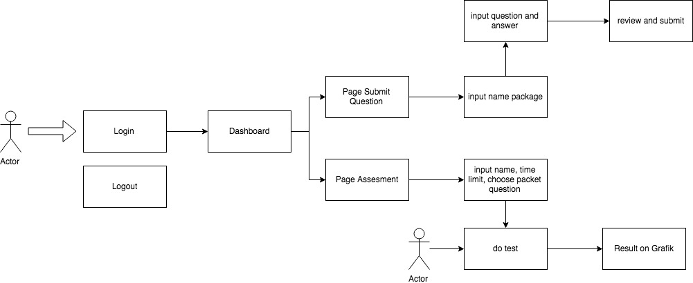

# Documentation Project Godox

## Project Description
Project ini dibuat untuk membuat test psikologi kepada penguna, user bisa test psikologi. 
sebagai admin untuk submit soal psikotest dan merivew user activity.  

## MVP for Admin User

 - [ ] Saya sebagai user admin akan melakukan signin.
 - [ ] Saya sebagai user admin akan melihat dashboard (kosongan dulu aja dashboardnya).
 - [ ] Saya sebagai user admin akan melakukan logout.
 - [ ] Saya sebagai user admin akan mengisi soal dan jawaban question (dikategorikan per paket).
 - [ ] Saya sebagai user admin akan melakukan assesmenets kepada pengguna dan memilih packet soal yang sudah dibuat.
 - [ ] Saya sebagai user admin akan melihat hasil assesmenets pengguna setelah selesai melakukan test dan melihat grafik dari hasil. 


## Flow Diagram 



## Technologi requiement

```
 springboot - for backend
 angular - for fontend
 heroku - for hosting
```  

## Authors

* **Robi Hidayat** - *backend* - [robihidayat](https://github.com/robihidayat)
* **Aditya Renaldi** - *frontend* - [aditrenaldi8](https://github.com/aditrenaldi8)


## Documentation for Beckend
[Documentation for Backend](backend/README.md)

## Documentation for Frontend 
[Documentation for Forntend](frontend/README.md)

## License

This project is licensed under the MIT License - see the [LICENSE.md](LICENSE.md) file for details

## Acknowledgments

* Hat tip to anyone whose code was used
* Inspiration
* etc


